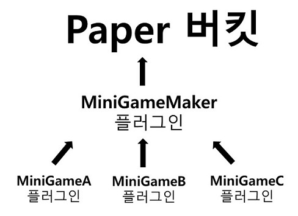

# 설명
- MiniGameMaker 기반의 미니게임 플러그인 제작에 관한 글
- MiniGameMaker 사용법은 [유저 위키] 참고

# 동작원리

- 미니게임메이커 플러그인을 기반으로 만든 미니게임 플러그인들은 서버가 시작되면 미니게임메이커에 게임이 등록되고, 관리됨 

# 환경 세팅 방법
- [Paper]
- [MiniGameMaker]
- [wbmMC] 
- 다운로드 후 build path 추가

## `plugin.yml`
- depend: `[MiniGameMaker]` 추가

# 주의사항

# 처리 이벤트 목록
※ `paper api` 기반으로 만들어졌기 때문에, paper기반 event도 사용가능(참고: [Paper API])  
※ 미니게임 이벤트는 해당 이벤트의 Player가 미니게임 플레이중인것이 확인되면 해당 미니게임 이벤트 처리 메소드로 넘어감  
※ 처리 이벤트의 하위 이벤트까지 모두 사용가능 (예. PlayerEvent의 PlayerJumpEvent)
- BlockBreakEvent
- BlockPlaceEvent
- PlayerEvent
- EntityEvent
- HangingEvent
- InventoryEvent
- InventoryMoveItemEvent
- InventoryPickupItemEvent
- PlayerLeashEntityEvent

# 제작 방법
## 미니게임 제작
1. 미니게임 클래스 제작
- 미니게임의 특성에 따라 상속할 미니게임 클래스 결정 후, 유의사항에 맞게 클래스 제작 
- `SoloMiniGame`: 1인 플레이
- `SoloBattleMiniGame`: 개인전 플레이
- `TeamMiniGame`: 팀 플레이
- `TeamBattleMiniGame`: 팀 대전 플레이
```

```
2. 미니게임 메이커에 등록
- MiniGameManager.getInstace()로 객체를 가져와서 registerMiniGame() 메소드로 미니게임 등록
```java
MiniGameManager minigameManager = MiniGameManager.getInstance();
this.minigameManager.registerMiniGame(new FitTool());
```

## 미니게임 Task 관리
- getTaskManager()로 TaskManager를 가져와서 사용
- `태스크 등록`: getTaskManager().registerTask("name", new BukkitRunnable() { // code });
- (태스크 등록은 initGameSetting() 메서드에서 작성되야 함)
- `태스크 호출`: getTaskManager().runTask("name");
```java
@Override
protected void initGameSetting() {
  // register task
  this.getTaskManager().registerTask("scoreTask", new BukkitRunnable() {

    @Override
    public void run() {
      // code
    }
  });
}
```
- BukkitRunabble에 등록해서 사용한(run) task는 다시 사용 불가능([BukkitRunnable 참고])
- MiniGame의 시스템 관련 task name(`_waitingTimer`, `_finishTimer`)는 등록, 사용 금지

## 기본적인 MiniGame의 오버라이딩 메소드 설명
- `initGameSetting()`: 미니게임 설정값 세팅메소드로 시작되기 전에 한번씩 꼭 실행되는 메소드
- `runTaskAfterStart()`: 미니게임이 실제로 시작 된 직후 실행되는 메소드
- `processEvent()`: 미니게임에 참여중인 플레이어의 이벤트를 처리해야 하는 메소드
- `getGameTutorialStrings()`: 미니게임 튜토리얼 출력할 문자 반환 메소드

## 미니게임 종료
- `endGame()` 메소드 사용

# 미니게임 참여/퇴장 방법 변경
- `참여`: MiniGameManager의 joinGame() 메소드 사용
- `퇴장`: MiniGameManager의 leaveGame() 메소드 사용

# API DOC


# minigames.json
- class 이름이 기준으로 등록됨
- 미니게임 생성자에서 설정한 기본값으로 설정됨


# 사용법 유튜브
[사용법]


# 연락
- [디스코드]

[유저 위키]: https://github.com/worldbiomusic/MiniGameMaker/blob/main/userWiki.md
[Paper]: https://papermc.io/
[MiniGameMaker]: https://github.com/worldbiomusic/MiniGameMaker/releases
[wbmMC]: https://github.com/worldbiomusic/wbmMC
[디스코드]: https://discord.com/invite/fJbxSy2EjA
[Paper API]: https://papermc.io/javadocs/paper/1.16/index.html?overview-summary.html
[BukkitRunnable 참고]: https://www.spigotmc.org/threads/prevent-already-scheduled-as-xxx-error.202486/#post-2103877
