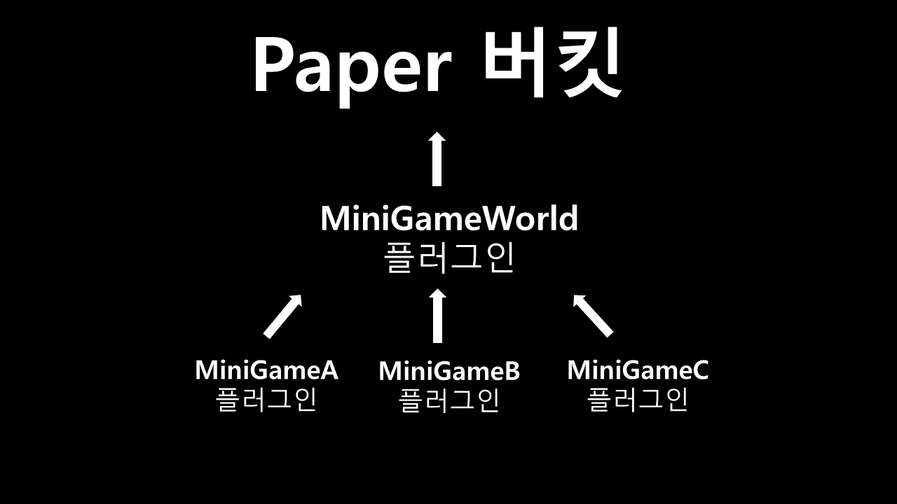
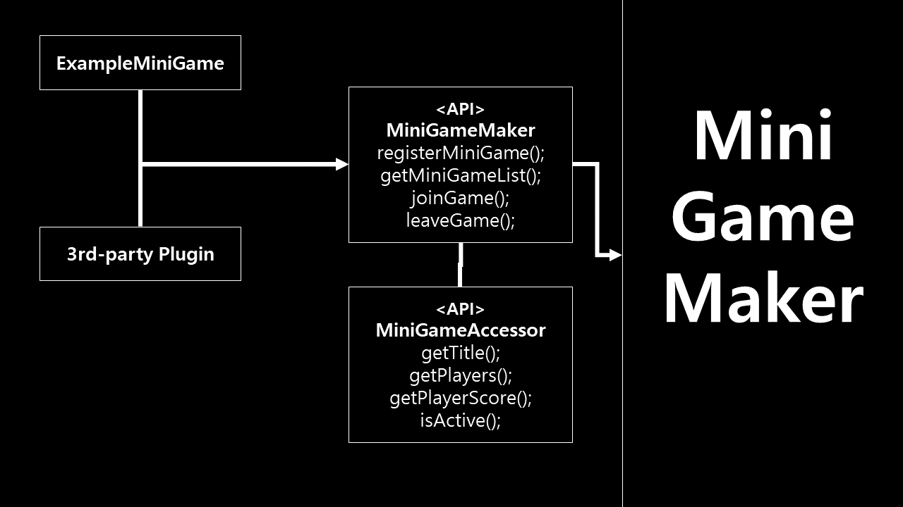
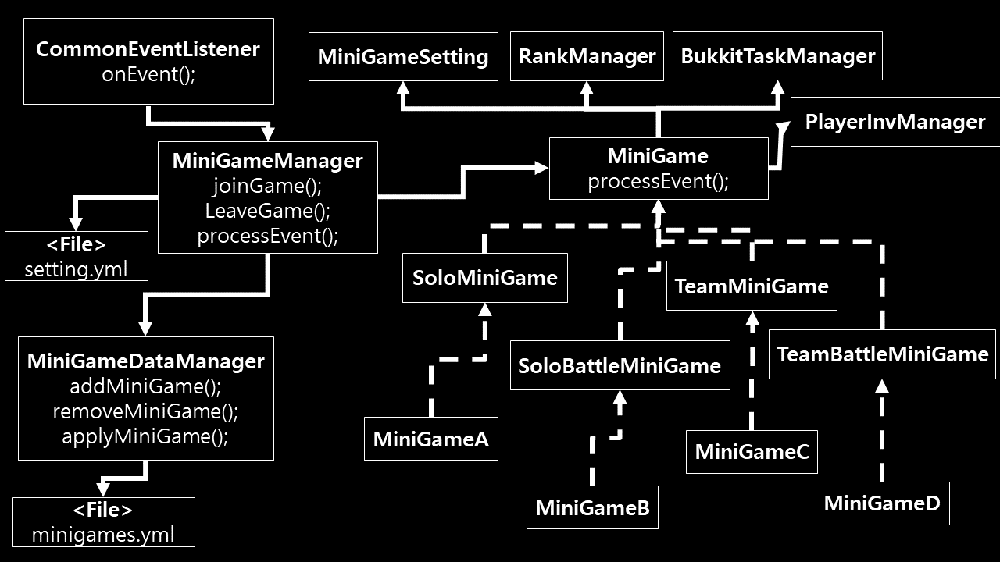

# 설명
- 플러그인의 구조 디자인을 문서화
- 하위 모든 위키는 [Template]의 형식을 기본으로 작성되야 함
- 한글로 먼저 작성 후, 영어도 작성
- 유저위키 정보도 참고

# 중요한 점
- 미니게임에서 사용되는 모든 이벤트에 대한 EventHandler는 CommonEventListener 클래스에서 등록됨(`classgraph` lib 사용)

# 구조
</img>
</img>

- 모든 미니게임은 MiniGameManager 클래스에 등록되어서 관리됨
- 파일은 yaml 포맷으로 관리됨 [Yaml정리](https://github.com/worldbiomusic/Blog/blob/main/Minecraft/plugin/making/YAML.md)

# 클래스
## com.wbm.minigameworld
- [Main](Main.md): 플러그인 메인

## com.wbm.minigameworld.commands
- [MiniGameCommand](MiniGameCommand.md): 미니게임 명령어 관련

## com.wbm.minigameworld.minigameframes
- [MiniGame](MiniGame.md): 미니게임 틀
- [MiniGameSetting](MiniGameSetting.md): 미니게임 설정값
- [SoloMiniGame](SoloMiniGame.md): 솔로 미니게임
- [SoloBattleMiniGame](SoloBattleMiniGame.md): 개인전 미니게임
- [TeamMiniGame](TeamMiniGame.md): 팀 미니게임
- [TeamBattleMiniGame](TeamBattleMiniGame.md): 팀 대항 미니게임

## com.wbm.minigameworld.manager
- [CommonEventListener](CommonEventListener.md): 서버 공통 이벤트 리스너
- [MiniGameDataManager](MiniGameDataManager.md): 미니게임 데이터 관련 매니저
- [MiniGameManager](MiniGameManager.md): 미니게임 주요 동작 관련 매니저

## com.wbm.minigameworld.observer
- [MiniGameEventNotifier](MiniGameEventNotifier.md): 미니게임 이벤트 동작 관련 Subject (Observer pattern)
- [MiniGameObserver](MiniGameObserver.md): 미니게임 이벤트 동작 관련 Observer (Observer pattern)

## com.wbm.minigameworld.util
- [Setting](Setting.md): 플러그인 세팅 관련 클래스
- [Utils](Utils.md): 유틸 클래스

## com.wbm.minigameworld.api
- [MiniGameAccessor](MiniGameAccessor.md): API class
- [MiniGameWorld](MiniGameWorld.md): plugin API class

# plugin.yml
- [plugin.yml](plugin.yml.md)

[Template]: template.md
