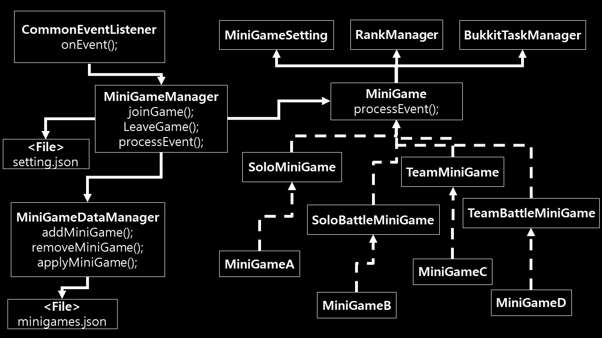

# 설명
- 플러그인의 구조 디자인을 문서화
- 하위 모든 위키는 [Template]의 형식을 기본으로 작성되야 함
- 한글로 먼저 작성

# 구조
- 모든 미니게임은 MiniGameManager 클래스에 등록되어서 관리됨
- 파일은 yaml 포맷으로 관리됨 [Yaml정리](https://github.com/worldbiomusic/Blog/blob/main/Minecraft/plugin/making/YAML.md)
- 

# 중요한 점
- 미니게임에서 사용되는 모든 이벤트에 대한 EventHandler는 CommonEventListener 클래스에서 등록됨(classgraph lib 사용)
- ### Json 숫자관련 주의사항
> - double형으로 값 불러오는 코드
> > `double a = (double) json.get("A");`
> - int형으로 값 불러오는 코드
> > 1. `int a = Double.valueOf((double))data.get("A").intValue();`
> > 2. `int a = (int) Math.round((double)json.get("A")).intValue();`

# 플러그인 주요 클래스 diagram

# 클래스
## com.wbm.minigamemaker
- [Main](Main.md): 
## com.wbm.minigamemaker.games
- FitTool: 
- RandomScore: 
- MoreHit:
- ScoreClimbing: 
- RelayJump: 
- RSP: 
- PVP: 

## com.wbm.minigamemaker.games.frame
- MiniGame: 
- MiniGameSetting: 
- SoloMiniGame: 
- SoloBattleMiniGame: 
- TeamMiniGame: 
- TeamBattleMiniGame: 

## com.wbm.minigamemaker.manager
- [CommonEventListener](CommonEventListener.md): 
- [MiniGameCommand](MiniGameCommand.md): 
- [MiniGameDataManager](MiniGameDataManager.md): 
- [MiniGameManager](MiniGameManager.md): 

## com.wbm.minigamemaker.util
- [Setting](Setting.md): 

# plugin.yml
- [plugin.yml](plugin.yml.md)

[Template]: template.md
