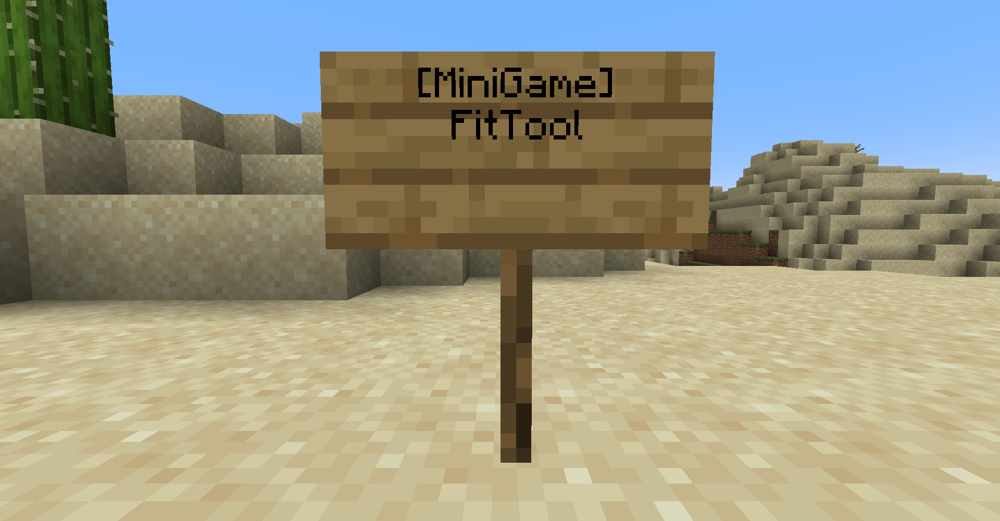

# 설명
- 서버에서 미니게임을 적용하기 위한 사람(어드민)들을 대상으로 작성된 글
- 기본 미니게임들이 포함되어 있음 (정식 출시 때는 jar로 따로 관리하기)


# 적용법
1. [미니게임 월드]와 [wbmMC] 플러그인을 다운
2. 추가로 사용할 미니게임 플러그인 다운
3. 서버 plugins 폴더에 [미니게임 월드]와 [wbmMC] 플러그인 위치하기
4. 서버 실행 후 미니게임 플레이


# 미니게임 사용법
1. 미니게임 파일 다운로드
2. 미니게임을 위한 장소는 직접 제작후
3. `minigames.yml`파일의 미니게임 `location`부분을 수정해서 위치 지정


# 참가 / 퇴장
## 참가
### 1. 표지판
</img>
- setting.yml의 minigameSign이 true로 설정되야 함

### 2. 명령어
- `/minigame join <title>`
- setting.yml의 minigameCommand가 true로 설정되야 함

## 퇴장
### 1. 표지판
</img>
- setting.yml의 minigameCommand이 true로 설정되야 함

### 2. 명령어
- `/minigame leave`
- setting.yml의 minigameCommand가 true로 설정되야 함


# 미니게임 종류
- 솔로
- 협동
- 개인 배틀
- 팀 배틀
- 커스텀


# 명령어
- `/minigame join <title>`: `<title>` 미니게임에 참가
- `/minigame leave`: 현재 참여중인 미니게임 퇴장
- `/minigame list`: 서버의 미니게임 리스트 출력
- `/minigame reload`: 설정 파일 리로드 (setting.yml, minigames.yml)


# 사용법 유튜브
[사용법]


# 주의사항
- 플러그인을 새로 추가했다면, 서버를 reload하지 말고 stop후에 다시 시작해애 함 (Task가 중복됨)
- 미니게임 `참가`때 아이템은 저장되고, `퇴장`때 복구됨
- 미니게임 `참가`/`퇴장`때 플레이어의 `체력 회복`, `배고픔 회복`, `숨김 제거`, `발광 제거`, `표션 효과 제거`가 적용됨


# 설정 파일
## `setting.yml`
- 플러그인 세팅 파일
```yml
setting:
  lobby:
    ==: org.bukkit.Location
    world: world
    x: 0.0
    y: 8.0
    z: 0.0
    pitch: 0.0
    yaw: 90.0
  minigameSign: true
  minigameCommand: true

```
- `lobby`: 게임이 끝나고 돌아가는 로비 위치
- `minigameSign`: 참나무 표지판 우클릭으로 미니게임을 참가/퇴장 수 있는 여부 (true / false)
- `minigameCommand`: 명령어로 미니게임 참가/퇴장 여부 (true / false)


## `minigames.yml`
- 미니게임들 설정 파일(예시)
```yml
minigames:
  PVP:
    title: PVP
    location:
      ==: org.bukkit.Location
      world: world
      x: 0.0
      y: 4.0
      z: 0.0
      pitch: 0.0
      yaw: 0.0
    waitingTime: 10
    maxPlayerCount: 5
    timeLimit: 300
    active: true
    customData:
      health: 30
      items:
      - ==: org.bukkit.inventory.ItemStack
        v: 2584
        type: STONE_SWORD
    tutorial: 
    - 'kill player: +1'
    - 'death: be a spectator'
```
- `title`: 게임 제목
- `location`: 입장 스폰 위치
- `waitingTime`: 대기시간 (초)
- `maxPlayerCount`: 최대 인원수 
- `timeLimit`: 플레이 제한 시간 (초)
- `active`: 게임 활성화 여부 (true/false)
- `customData`: 미니게임의 커스텀 설정 값
- `tutorial`: 튜토리얼 설명글
- 플러그인으로 넣은 미니게임이 자동으로 `minigames.yml`에 등록됨 
- 없는 미니게임은 서버가 종료된 후 `minigames.yml`에서 삭제됨
- 각 미니게임에 맞게 기본값이 설정되어 있음 (각 미니게임의 기본값 변경 원할 시: 해당 미니게임 개발자에게 질문)


# 연락
- [디스코드]

[미니게임 월드]: https://github.com/worldbiomusic/MiniGameWorld/releases
[wbmMC]: https://github.com/worldbiomusic/wbmMC
[디스코드]: https://discord.com/invite/fJbxSy2EjA
