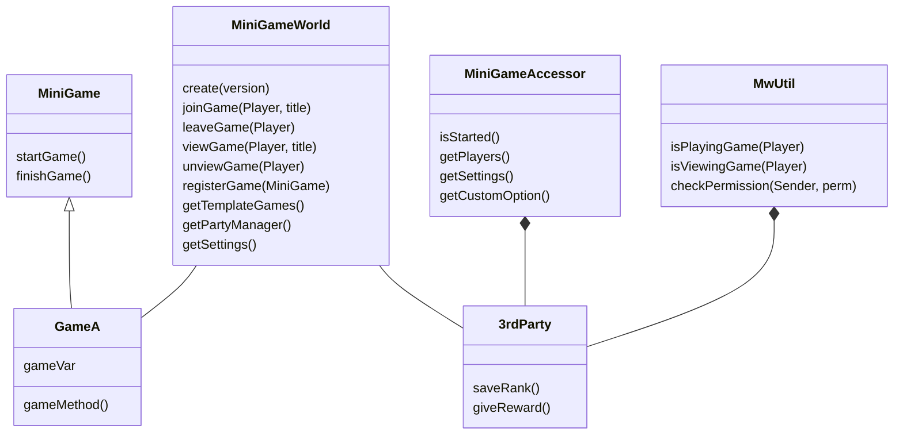

# Description
This doucment describes how to make a `Minigame`, `Third-Party` plugin.
- MiniGameWorld plugin's structure: [MiniGameWorld]

# Features
- Simple and foolish API
- Custom data with `Map<String, Object>` which user can edit
- Each minigames is isolated from the each other (doesn't affect to each other)
- Minigame util tools (score, soreboard, live, task ...etc)
- API for 3rd-party
- Custom Events
- Update checker
- Language support

# Tutorial
- ## [how to create minigame](game-guide/Home.md)
- ## [how to create 3rd party](3rd-party-guide/Home.md)

# API design

- [MiniGameWorld API](https://minigameworlds.github.io/MiniGameWorld/)

# More
- [Patch Note](https://github.com/MiniGameWorlds/MiniGameWorld/blob/main/resources/devWiki/log.md)
- [Scoreboard Conflict]
- [MiniGameWorld plugin](dev-plugin-home.md)

[Spigot]: https://getbukkit.org/download/spigot
[Paper]: https://papermc.io/
[MiniGameWorld]: plugin-design.md
[wbmMC]: https://github.com/etc-repo/wbmMC/releases
[Paper API]: https://papermc.io/javadocs/paper/1.16/index.html?overview-summary.html
[Scoreboard Conflict]: https://github.com/MiniGameWorlds/MiniGameWorld/blob/main/resources/userWiki/scoreboard.md

