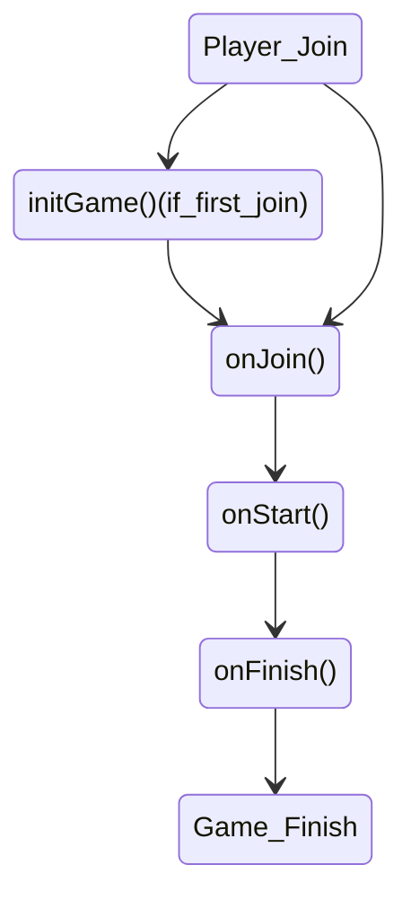

# Description
- Make a minigame with [API] docs

# Tutorial
## Solo
- [JumpMap](solo-JumpMap.md)

## Solo Battle
- [OnePunch](solobattle-OnePunch.md)
- [HungryFishing](solobattle-HungryFishing.md)

## Team
- [.](.) (In making...)

## Team Battle
- [.](.) (In making...)

## Fake
- [.](.) (In making...)

---

# Basic
- [setup.md](setup.md)
- [Game types](game-types.md)
- [Game methods](game-methods.md)

# Features
- [Settings](settings.md)
- [Custom options](custom-options.md)
- [Task management](task-management.md)
- [Custom data](custom-data.md)
- [Event handler](event-handler.md)
- [Exception handling](exception-handling.md)
- [Game Player](game-player.md)
- [Message and sound](message-and-sound.md)
- [Settings and Utils](settings-and-utils.md)
- [Bungeecord (in editing)](bungeecord.md)
- [Custom scoreboard (in editing)](custom-scoreboard.md)

---

# Warnings
## Player state management
- MiniGameWorld manages and restores player's states when join / leave
> `Inventory`, `Health`, `Food level`, `Exp`, `Potion Effects`, `Glowing`, `Hiding`, `Game Mode` and etc
- If the minigame has changed any of the unmanageable state in the list above, must to restore all the changed state at the game finished using `onFinish()`

## Override
- Almost overrided method should maintain `super.method()`

## Player Death
- If player is dead state when the minigame finished, player will not be able to leave the game (never let the player die while game is in playing)

## Flow

[API]: https://minigameworlds.github.io/MiniGameWorld/
[Detectable Event List]: detectable-event-list.md