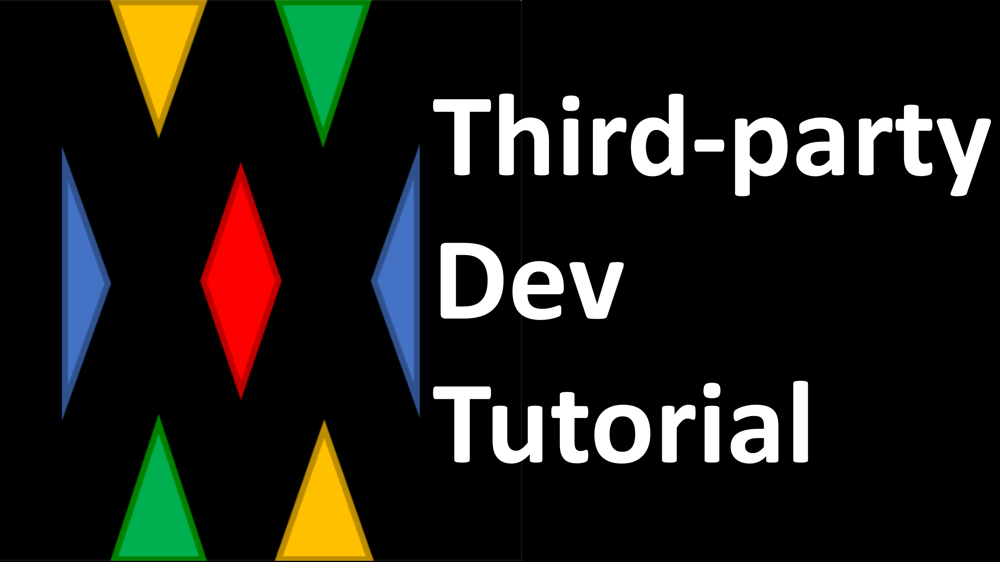

# Description
- Third party plugin can access/change below things
```yaml
- Join/Leave 
- Minigame Exception
- Menu
- Party
- Observer
```

# Tutorial
<a href="https://youtu.be/">
</img>
</a>
- In making...

---

# Minigame Join/Leave
- Can change `Join/Leave` way 
## Example
```java
// join minigame with portal
@EventHandler
public void onPlayerEnterPortal(EntityPortalEnterEvent e) {
  if (e.getEntity() instanceof Player) {
    Player p = (Player) e.getEntity();
    MiniGameWorld mw = MiniGameWorld.create("x.x.x");
    // join minigame
    mw.joinGame(p, "Minigame-Title");
  }
}

// leave minigame with right-click block
@EventHandler
public void onPlayerClickLeaveBlock(PlayerInteractEvent e) {
  Player p = e.getPlayer();
  if (e.getAction() == Action.RIGHT_CLICK_BLOCK) {
    Block b = e.getClickedBlock();
    if (b.getType() == Material.BEDROCK) {
      MiniGameWorld mw = MiniGameWorld.create("x.x.x");
      // leave minigame
      mw.leaveGame(p);
    }
  }
}
```
---

# Minigame Exception
- Can process various exceptions
## Example
- Send custom exception to minigames
```java
public void processServerEvent(Player p) {
	MiniGame.Exception ex = MiniGame.Exception.CUSTOM;
	ex.setDetailedReason("SERVER_EVENT_TIME");
	MiniGameWorld mw = MiniGameWorld.create("x.x.x");
	mw.handleException(p, ex, null);
 }
```

- Handle exception in minigame
```java
@Override
 protected void handleGameException(Player p, Exception exception, Object arg) {
	super.handleGameException(p, exception);
	if (exception == MiniGame.Exception.CUSTOM) {
		String detailedReason = exception.getDetailedReason();
		if (detailedReason.equals("SERVER_EVENT_TIME")) {
			// process somethings
		}
	}
 }
```
---

# Menu
- Can add custom slot to `menu`
- Beware of already exist slot in `menu` inventory
## Example
- Add custom slot to menu
```java
@Override
public boolean onCommand(CommandSender sender, Command cmd, String label, String[] args) {
	// only player
	if (!(sender instanceof Player)) {
		return true;
	}

	Player p = (Player) sender;

	if (args[0].equalsIgnoreCase("m")) {
		MiniGameWorld mw = MiniGameWorld.create("x.x.x");

		// get opened menu inventory
		Inventory inv = mw.openMiniGameMenu(p);

		// custom slot
		ItemStack customSlot = new ItemStack(Material.REDSTONE);
		ItemMeta meta = customSlot.getItemMeta();
		meta.setDisplayName("custom slot");
		customSlot.setItemMeta(meta);

		// set slot to inv
		inv.setItem(7, customSlot);
	}

	return true;
}
```
---

# Party
- Can use different way to access party
```java
/*
 * Ask a player to join party by right-click	
 */
@EventHandler
public void onPlayerAskPartyJoin(PlayerInteractAtEntityEvent e) {
	// check clicked entity is a player
	if (!(e.getRightClicked() instanceof Player)) {
		return;
	}

	Player asker = e.getPlayer();
	Player asked = (Player) e.getRightClicked();

	// get party manager
	MiniGameWorld mw = MiniGameWorld.create("x.x.x");
	PartyManager partyManager = mw.getPartyManager();

	// show ask clickable chat to asked player
	partyManager.ask(asker, asked);
}
```

---

# Observer System
- Observer can reserve tasks with event of MiniGame
## MiniGameEvent
- `START`: When minigame started
- `BEFORE_FINISH`: Before minigame finished (Used for saving rank data)
- `FINISH`: When minigame finished
- `EXCEPTION`: When exception created
- `EVENT_PASS`: When event passed to the minigame
- `REGISTRATION`: When minigame is registered to MiniGameWorld plugin
- `UNREGISTRATION`: When minigame is unregistered from MiniGameWorld plugin


## Examples
### Reward System
- [Example Plugin: MiniGameWorld-Reward](https://github.com/MiniGameWorlds/MiniGameWorld-Reward)
- Give reward when minigame finished
- Can distinguish with `class name` or `title` of minigame
```java
class RewardManager implements MiniGameObserver {

	public RewardManager(MiniGameWorld mw) {
		mw.registerMiniGameObserver(this);
	}

		@Override
	public void update(MiniGameAccessor minigame, MiniGameEvent event) {
		// give rewards when finish
		if (event == MiniGameEvent.FINISH) {
			List<? extends MiniGameRankResult> rankList = minigame.getRank();

			for (int i = 0; i < 3; i++) {
				MiniGameRankResult rankResult = rankList.get(i);
				for (Player p : rankResult.getPlayers()) {
					// give rewards
					p.getInventory().addItem(new ItemStack(Material.OAK_WOOD, 10 - i));
				}
			}
		}
	}
}
```
### Save Rank Data
- [Example Plugin: MiniGameWorld-Rank](https://github.com/MiniGameWorlds/MiniGameWorld-Rank)
- Save rank data to config
```java
@Override
public void update(MiniGameAccessor minigame, MiniGameEvent event) {
	if (event == MiniGameEvent.FINISH) {
		
		List<? extends MiniGameRankResult> rankResult = minigame.getRank();

		// check rank is empty
		if (rankResult.isEmpty()) {
			return;
		}

		// get minigame data section
		String minigameClassName = minigame.getClassName();
		ConfigurationSection section = plugin.getConfig().getConfigurationSection(minigameClassName);
		
		for(MiniGameRankResult result : rankResult) {
			int score = result.getScore();
			for(Player p : result.getPlayers()) {
				// get player's name, score
				String playerName = p.getName();

				// set data
				section.set(playerName, score);
			}
		}
		
		// save config
		plugin.saveConfig();
	}
}
```


---


# Custom minigame event detector
- `Event` passed to minigame is filtered by player's minigame in the default MiniGameEventDetector.
- However, custom detector allows you to pass event you want to all minigames

## Example
1. Create custom detector
```java
class MyCustomEventDetector implements MiniGameEventExternalDetector {

	@Override
	public Set<Player> getPlayersFromEvent(Event event) {
		Set<Player> players = new HashSet<>();

		// Make ProjectileLaunchEvent event pass to all minigames if shooter is a player
		if (event instanceof ProjectileLaunchEvent) {
			ProjectileLaunchEvent e = (ProjectileLaunchEvent) event;
			Projectile proj = e.getEntity();
			if (proj.getShooter() instanceof Player) {
				Player shooter = (Player) proj.getShooter();
				players.add(shooter);
			}
		}
		return players;
	}
}
```

2. Register detector to `MiniGameWorld`
```java
public class MyPluginMain extends JavaPlugin {
	@Override
	public void onEnable() {
		MiniGameWorld mw = MiniGameWorld.create("x.x.x");
		
		// register custom detector
		mw.registerMiniGameEventExternalDetector(new MyCustomEventDetector());
	}
}
```