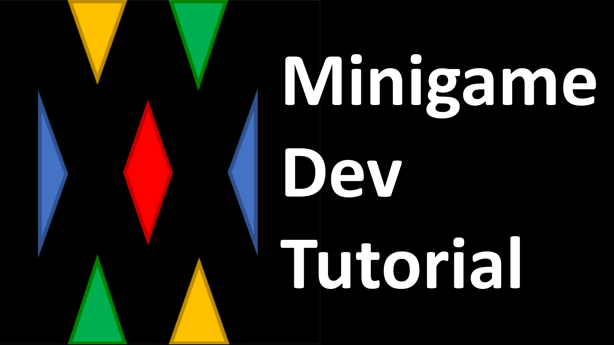
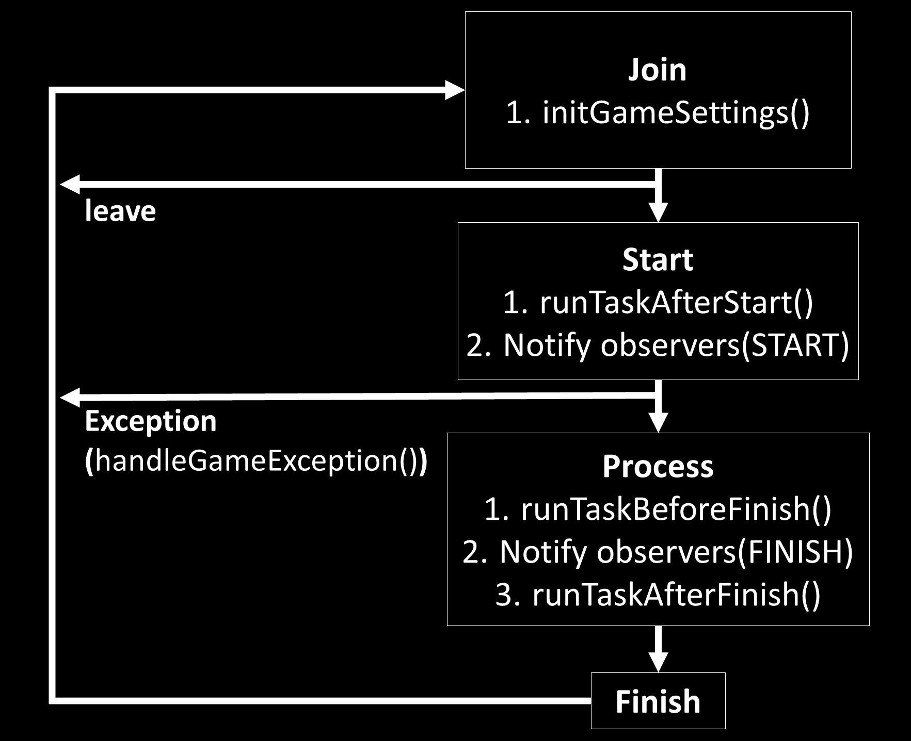

# Description
- Make a minigame with [API] docs


# Tutorial
<!-- - [Solo Tutorial-Youtube](https://www.youtube.com/watch?v=ibilvmzcdzs&list=PLOyhTkb3nnYbBtEdS38nkIpyU8RM-pEZd&index=)  
<a href="https://www.youtube.com/watch?v=ibilvmzcdzs&list=PLOyhTkb3nnYbBtEdS38nkIpyU8RM-pEZd&index=1">
</img>
</a> -->
- [Solo](solo-tutorial.md) (In making...)
- [Solo Battle](solo-battle-tutorial.md)
- [Team](team-tutorial.md) (In making...)
- [Team Battle](team-battle-tutorial.md) (In making...)
---

# Order
## 1. Setup dev environment
- [Link](https://github.com/MiniGameWorlds/MiniGameWorld/blob/main/resources/devWiki/making-minigame-home.md#how-to-set-dev-environment)


## 2. Create class
- Select a minigame frame

### `SoloMiniGame`
- _Solo play_
- [FitTool](https://github.com/MiniGameWorlds/AllMiniGames/blob/main/src/com/worldbiomusic/allgames/games/solo/FitTool.java)


### `SoloBattleMiniGame`
- _Individual battle play_
- [FallingBlock](https://github.com/MiniGameWorlds/AllMiniGames/blob/main/src/com/worldbiomusic/allgames/games/solobattle/FallingBlock.java)
- [PVP](https://github.com/MiniGameWorlds/AllMiniGames/blob/main/src/com/worldbiomusic/allgames/games/solobattle/PVP.java)
- [RandomScore](https://github.com/MiniGameWorlds/AllMiniGames/blob/main/src/com/worldbiomusic/allgames/games/solobattle/RandomScore.java)
- [RockScissorPaper](https://github.com/MiniGameWorlds/AllMiniGames/blob/main/src/com/worldbiomusic/allgames/games/solobattle/RockScissorPaper.java)
- [ScoreClimbing](https://github.com/MiniGameWorlds/AllMiniGames/blob/main/src/com/worldbiomusic/allgames/games/solobattle/ScoreClimbing.java)
- [SuperMob](https://github.com/MiniGameWorlds/AllMiniGames/blob/main/src/com/worldbiomusic/allgames/games/solobattle/SuperMob.java)

### `TeamMiniGame`
- _Cooperative play_
- [BreedMob](https://github.com/MiniGameWorlds/AllMiniGames/blob/main/src/com/worldbiomusic/allgames/games/team/BreedMob.java)
- [RemoveBlock](https://github.com/MiniGameWorlds/AllMiniGames/blob/main/src/com/worldbiomusic/allgames/games/team/RemoveBlock.java)

### `TeamBattleMiniGame`
- _Team battle play_
- [HiddenArcher](https://github.com/MiniGameWorlds/AllMiniGames/blob/main/src/com/worldbiomusic/allgames/games/teambattle/HiddenArcher.java)
- [MoreHit](https://github.com/MiniGameWorlds/AllMiniGames/blob/main/src/com/worldbiomusic/allgames/games/teambattle/MoreHit.java)
- [PassMob](https://github.com/MiniGameWorlds/AllMiniGames/blob/main/src/com/worldbiomusic/allgames/games/teambattle/PassMob.java)


## 3. Essential methods
### `initGameSetting()`
- Executed every time when minigame starts
### `processEvent()`
- Executed when event is passed to minigame
- 
### `registerTutorial()`
- Return minigame tutorial string list
- Strings in list will print when a player join a minigame


## 4. Set [Options](#Options)
- Can set various options for minigame
- You must check [custom options](#--minigamecustomoption) for your minigame environment


## 5.Register MiniGame
- Register MiniGame with registerMiniGame() of MiniGameWorld.create()
```java
MiniGameWorld mw = MiniGameWorld.create("x.x.x");
mw.registerMiniGame(new FitTool());
```

---

# Options
## - **Setting**
- Fundamental settings of minigame (See api doc for Init value)

- `title`: Minigame title (can be different with Class Name)
- `location`: Minigame join location
- `minPlayerCount`: Minimun player count for start game
- `maxPlayerCount`: Maximun player count for playing game
- `waiting_Time`: Waiting time (sec)
- `timeLimit`: Minigame playing time limit (sec)
- `active`: Whether this minigame is active in the server(true/false)
- `settingFixed`: fix setting to prevent to edit by user: `minPlayerCount`, `maxPlayerCount`, `timeLimit`, `customData` (can't edit in config)
- `tutorial`: Tutorials
- `customData`: Custom data created by developer or default custom options
- `icon`: Material which show in menu (Material)
detail (e.g. check player from event is playing current minigame))
- `gameFinishCondition`: Game finish condition (Init: LESS_THAN_PLAYERS_LIVE (2))
> e.g. game will finish in these condition
> - `- GameFinishCondition = LESS_THAN_PLAYERS_LIVE`  
`- gameFinishConditionPlayerCount = 2`  
`- live players count = 1`  
> - `- GameFinishCondition = MORE_THAN_PLAYERS_LIVE`  
`- gameFinishConditionPlayerCount = 5`  
`- live players count = 6`  
> - `- GameFinishCondition = LESS_THAN_PLAYERS_LEFT`  
`- gameFinishConditionPlayerCount = 4`  
`- left players count = 3`  
- `gameFinishConditionPlayerCount`: Used with `gameFinishCondition` (Init: 2)
- `view`: If true, players can view the minigame
- `customDetectableEvents`: Custom detectable event list ([Detectable Event List])
- `useEventDetector`: If false, no events will be passed to the minigame ([Detectable Event List])
- `scoreboard`: If true, scoreboard will be shown to players (`scoreboard` option in settings.yml needed)

### How to use
```java
public PassMob() {
  super("PassMob", 2, 60 * 3, 10);
  // settings
  this.getSetting().setIcon(Material.OAK_FENCE);
}
```

## - **CustomOption**
- Below custom options are created in `custom-data` section by default (See api doc for Init value)
- `CHAT`: whether chat event cancel
- `SCORE_NOTIFYING`: whether notify score change
- `BLOCK_BREAK`: whether player can break block
- `BLOCK_PLACE`: whether player can place block
- `PVP`: whether players can damage each other (contains Projectile)
- `PVE`: whether player and mob can damage each other (contains Projectile)
- `INVENTORY_SAVE`: whether inventory save
- `MINIGAME_RESPAWN`: whether player will be respawn in minigame location
- `LIVE_GAMEMODE`: gamemode when a player join a minigame
- `DEAD_GAMEMODE`: gamemode when a player's live changed to false in a minigame
- `COLOR`: minigame custom color
- `FOOD_LEVEL_CHANGE`: whether player's food level(hunger) changes
- `PLAYER_HURT`: whether a player damaged by something 
### How to use
```java
public PassMob() {
  super("PassMob", 2, 60 * 3, 10);
  // custom options
  this.getCustomOption().set(Option.MINIGAME_RESPAWN, false);
}
```

## - **Task Management**
- Can manage task easily
- Don't need cancellation
- `Register`: `getTaskManager().registerTask("name", new Runnable() { // code });` in anywhere
- `Run`: `getTaskManager().runTask("name");` in anywhere **after registration**
- Do not register/run system task(`_waiting-timer`, `_finish-timer`, `_update-scoreboard`)
- **Do not register a task with `BukkitRunnable`**, but with Runnable
- **If you use your own tasks, make sure that finish the tasks when the game finished using `MiniGame.runTaskBeforeFinish()`**
### How to register
```java
@Override
protected void registerTasks() {
  // register task
  this.getTaskManager().registerTask("task1", new Runnable() {

    @Override
    public void run() {
      // code
    }
  });
}
```
### How to use
```java
@Override
protected void processEvent(Event event) {
  this.getTaskManager().runTask("task1");
  // or
  this.getTaskManager().runTaskLater("task1", 20 * 5);
  // or
  this.getTaskManager().runTaskTimer("task1", 0, 20);
}
```


## - **Exception handling**
- There are 2 types of exception
1. `Player exception`: Only player related with exception will leave a playing minigame
2. `Server exception`: All minigames in server will be finished (Also all players will leave minigame). Can be used for handling certain server event or finishing all minigames

### How to create exception
- Player exception
```java
void teleportLotteryFirstPrize() {
  Player firstPrizePlayer = Bukkit.getPlayer("lotteryMan");
  // pass the player involved in the exception
  MiniGameExceptionEvent exceptionEvent = new MiniGameExceptionEvent("lottery-1", firstPrizePlayer);
  
  // call minigame exception event
  Bukkit.getServer().getPluginManager().callEvent(exceptionEvent);
}
```

- Server exception
```java
void startServerSundayEvent() {
  MiniGameExceptionEvent exceptionEvent = new MiniGameExceptionEvent("server-sunday-event-time");
  
  // call minigame exception event
  Bukkit.getServer().getPluginManager().callEvent(exceptionEvent);
}
```

### How to handle exception
- Player exception
```java
@EventHandler
public void onMiniGameExceptionEvent(MiniGameExceptionEvent e) {
  String reason = e.getReason();

  // check event is player exception
  if (e.isPlayerException()) {
    if (reason.equals("lottery-1")) {
      Player p = e.getPlayer();
      p.teleport(ServerLotteryPlace);
    }
  }
}
```

- Server exception
```java
@EventHandler
public void onMiniGameExceptionEvent(MiniGameExceptionEvent e) {
  String reason = e.getReason();
  
  // check event is server exception
  if (e.isServerException()) {
    if (reason.equals("server-sunday-event-time")) {
      Bukkit.getOnlinePlayers().forEach(p -> p.teleport(ServerEventPlace));
    }
  }
}
```


## - **Custom Data**
- Minigame Developer can add custom data
- Minigame User can play and edit custom data
- Must use `register` and `load` together
### How to register
- Override `registerCustomData()` and add data
```java
@Override
protected void registerCustomData() {
  Map<String, Object> customData = this.getCustomData();
  customData.put("health", 30);
  List<ItemStack> items = new ArrayList<>();
  items.add(new ItemStack(Material.STONE_SWORD));
  customData.put("items", items);
}
```
### How to load/use
- Override `loadCustomData()` and load data
```java
@Override
protected void loadCustomData() {
  // set health scale
  this.health = (int) this.getCustomData().get("health");
  // give kit tool
  List<ItemStack> items = (List<ItemStack>) this.getCustomData().get("items");
  items.forEach(item -> p.getInventory().addItem(item));
}
```


## - **Task Reservation**
- `runTaskAfterStart()`: executed after minigame started
- `runTaskBeforeFinish()`: executed before minigame finishes
- `runTaskAfterFinish()`: executed after minigame finished
### Example
```java
@Override
protected void runTaskAfterStart() {
  super.runTaskAfterStart();
  // give kits
  for (Player p : getPlayers()) {
    InventoryTool.addItemToPlayer(p, new ItemStack(Material.IRON_SWORD));
    InventoryTool.addItemToPlayer(p, new ItemStack(Material.BOW));
    InventoryTool.addItemToPlayer(p, new ItemStack(Material.ARROW, 64));
  }
}
```


## - **Custom Scoreboard**
- Each minigames can customize for own scoreboard
### Using hook method
- Override `updateScoreboard()` hook method in your minigame
```java
@Override
public void updateScoreboard() {
  super.updateScoreboard();

  // update only play scoreboard
  if (getScoreboardManager().getCurrentScoreboardType() == ScoreboardType.PLAY) {
    MiniGameScoreboardUpdater updater = getScoreboardManager().getPlayScoreboardUpdater();
    
    // get scoreboard last line
    int scoreLine = updater.getSidebarLastScoreLine();

    // get objective
    Objective obj = getScoreboardManager().getScoreboard().getObjective(DisplaySlot.SIDEBAR);
    Score score = obj.getScore("test stat");
    score.setScore(scoreLine - 1);
  }
}
```

### Using Custom Updater
- Create a class extends `MiniGameSidebarScoreboardUpdater`
```java
class YourScoreboardUpdater extends MiniGameScoreboardSidebarUpdater {

	public MiniGamePlayScoreboard(MiniGame minigame) {
		super(minigame);
	}

	@Override
	public void updateScoreboard() {
		// DO if you want override default scores template 
		super.updateScoreboard();

		Objective sidebarObjective = scoreboard.getObjective(DisplaySlot.SIDEBAR);

		// custom stats
		Score playerListTitle = sidebarObjective.getScore(ChatColor.BOLD + "Custom stats");
		playerListTitle.setScore(sidebarScoreLine--);

		// empty line
		addEmptyLineToSiderbar();
	}
}
```
- After then, set updater in the minigame constructor
```java
//set custom scoreboard updater
getScoreboardManager().setPlayScoreboardUpdater(new YourScoreboardUpdater(this));
```


## - **Players**
- `containsPlayer()`: check player is contained
- `getPlayers()`: get minigame participants List
- `getPlayerCount()`: get participants count
- `getLivePlayers()`: return live players
- `randomPlayer()`: return random players among participants
- `sendMessage()`: send message to player
- `sendTitle()`: send title to player


## - **PlayerData**
- manage `score`, `live`
- `getPlayerData()`: get player data of minigame (`score`, `live`)
- `plusScore()`: plus player score
- `minusScore()`: minus player score
- `setLive()`: set player live
- `isLive()`: check player is live


## - **etc**
- `finishGame()`: finish minigame, **Must be used for endpoint of a minigame, never run anything after finishGame()**
- `getLeftWaitingTime()`: get left waiting time (sec)
- `getLeftFinishTime()`: get left time to finish (sec)


---


# Caution
## Player state management
- MiniGameWorld manages and restores player's states when join / leave
> `Inventory`, `Health`, `Food level`, `Exp`, `Potion Effects`, `Glowing`, `Hiding` and `Game Mode`
- If the minigame has changed any of the unmanageable state in the list above, must to restore all the changed state at the game finished using `runTaskBeforeFinish()`

## Detectable Events
- MiniGameWorld only passes detectable event to the minigame a player of event is playing now, so you don't have to check the player is playing the minigame
- Can use all sub-events of detectable events (i.e.  `PlayerDeathEvent`, `PlayerJoinEvent`, `PlayerJumpEvent`... of `PlayerEvent`)
- If **needs event not related with player** or **event is not passed to the minigame**, add `customDetectableEvent` option or implement `Listener`
- Check here: [Detectable Event List]

## Override
- Almost overrided method should maintain `super.method()`

## Player Death
- Player can't return to joined location from minigame location, if player is dead state when minigame finished (don't let the player die with using any other ways when minigame finished)

## GameFinishCondition Auto Checking Point
- When `MiniGame.handleException()`, `<minigame>.handleGameException()` executes
- When `MiniGamePlayerData.setLive()`, `MiniGame.setLive()` executes
- Do **NOT** run anything about a player after `<minigame>.handleGameException()` and `MiniGamePlayerData.setLive()` or game finished
```yaml
Default minigame setting will be finished less than... (If GameFinishCondition is LESS_THAN_PLAYERS_LIVE)
- Solo: 1
- SoloBattle: 2
- Team: 1
- TeamBattle: 2
```


## How to use other custom Event
- If you want to process custom event of another plugin in minigame, just make minigame implement `Listener` and add a `EventHandler method`


## Flow
</img>

[API]: https://minigameworlds.github.io/MiniGameWorld/
[Detectable Event List]: detectable-event-list.md