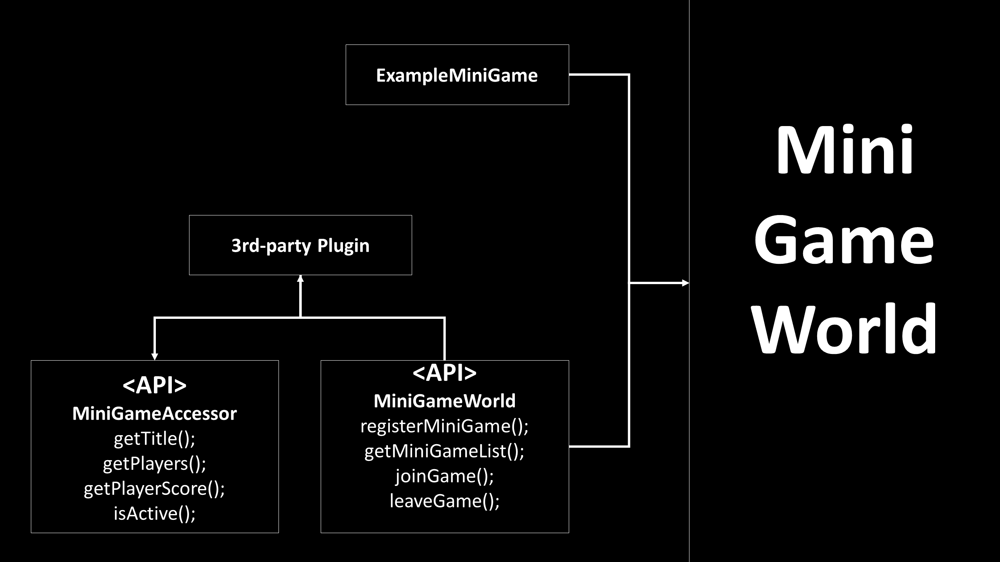

# Description
- This doucment describes how to make a `Minigame`, `Third-Party` plugin
- About MiniGameWorld plugin's structure: [MiniGameWorld]

# Guide
## MiniGame
- [making-minigame-guide](making-minigame-guide.md)

## Third party plugin
- [making-3rd-party-guide](making-3rd-party-guide.md)

# API design
<!-- </img> -->

- `Custom minigame` and `third-party` uses `MiniGameWorld` API
## Document
- [MiniGameWorld API](https://minigameworlds.github.io/MiniGameWorld/) ([list](https://github.com/MiniGameWorlds/MiniGameWorld/blob/main/docs/README.md))

# How to set Dev Environment
- [Spigot] or [Paper]: Minecraft bukkit
- [MiniGameWorld]: MiniGame Framework
- [wbmMC]: Minecraft util library
- Add build path jars
- Add `[MiniGameWorld]` to `depend` section in `plugin.yml`

# **[Patch Notes](https://github.com/MiniGameWorlds/MiniGameWorld/blob/main/resources/devWiki/log.md)**

# Using Library
- This project uses [classgraph](https://github.com/classgraph/classgraph) library licensed from MIT to register all events in  Minecraft bukkit

[Spigot]: https://getbukkit.org/download/spigot
[Paper]: https://papermc.io/
[MiniGameWorld]: https://github.com/MiniGameWorlds/MiniGameWorld/releases
[wbmMC]: https://github.com/worldbiomusic/wbmMC/releases
[Paper API]: https://papermc.io/javadocs/paper/1.16/index.html?overview-summary.html
