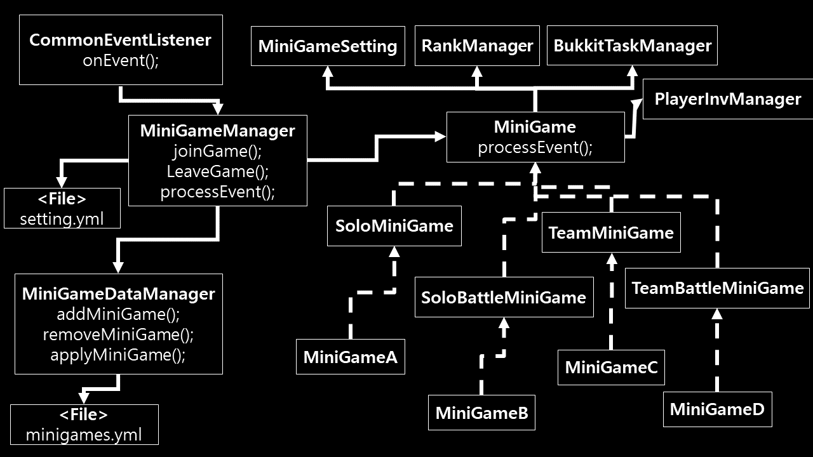

# Description
- Document for plugin design

# Design
</img>
</img>

- All minigames managed by `MiniGameManager` after registered
- Use YamlManager of `WbmMC` library for managing config

# Rules
- **Modular Design**
- **Must** use `LinkedHashMap` instead of `HashMap` if it related with config operation to sort key order
- Minigame always processes `Event` in last (`Priority.HIGHEST`) (Use `Priority.MONITOR` for more important thing)
- No Plugin can edit any MiniGame data (but inevitably, players can be accessed)
- API returns **clone** instance for data security (use Cloneable)
- Most features should be considered for use as APIs
- Check the permissions at the end of the process, not before the command with
- A custom event is called when the action associated with the event is determined to be processed (= after all "if" conditions check) (e.g. `MiniGamePlayerJoinEvent` in `MiniGame` after checking all conditions in `MiniGameManager`)