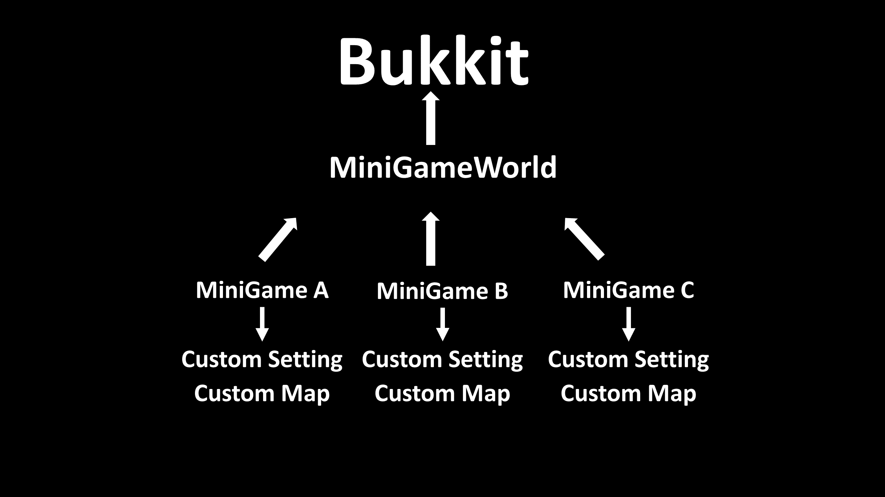

# Description
- Document for plugin design

# Design
</img>
</img>

- All minigames managed by `MiniGameManager` after registered
- Use YamlManager of `WbmMC` library for managing config

# Caution
- **Must** use `LinkedHashMap` instead of `HashMap` if it related with config operation to sort key order
- Minigame always processes `Event` in last (`Priority.HIGHEST`)