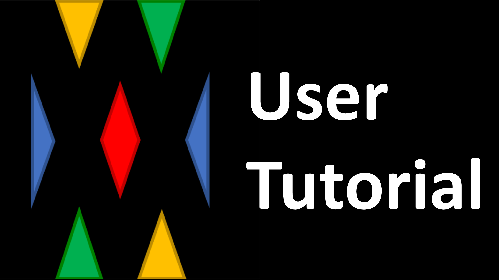

# Description
- This document describe how to use MiniGameWorld pluin in your server
- Plugin works on `spigot`, `paper` bukkit
- MiniGame types: `Solo`, `SoloBattle`, `Team`, `TeamBattle` and `custom`

# How to apply
1. Download [MiniGameWorld] and [wbmMC]
2. Download [MiniGames] that you want to add to your server
3. Put `MiniGameWorld`, `wbmMC` and `minigame plugins` in server `plugins` folder
4. Make a place for minigame yourself
5. Update minigame location in `plugins/MiniGameWorld/minigames/<class-name>.yml` file and run command `/minigame reload`  
**`or`**  
Update minigame location using command `/minigame minigames <class-name> location <<player> | <x> <y> <z>>`  

# Download
- [MiniGameWorld]: MiniGameWorld Framework
- [wbmMC]: Essential library
- [MiniGames]: MiniGames made by some makers
- [Third-Parties]: You can `give reward with rank `, `save rank data` and etc with third party plugins

# Youtube Tutorial
<a href="https://www.youtube.com/watch?v=sE0vaj0xM8Q">
</img>
</a>

# More
- [Join / Leave]
- [Commands]
- [Config]
- [Permissions]
- [Party]
- [Backup]

# Caution
- Not recommend to run `/reload` in the server console
- A player's `Inventory`, `Health`, `Food level`, `Exp`, `Potion Effects`, `Glowing`, `Hiding` and `Game Mode` are saved at the game start and restored when the game finished

[MiniGameWorld]: https://github.com/MiniGameWorlds/MiniGameWorld/releases
[wbmMC]: https://github.com/worldbiomusic/wbmMC/releases
[MiniGames]: https://github.com/MiniGameWorlds/MiniGameWorld/discussions/categories/minigames
[Commands]: commands.md
[Third-Parties]: https://github.com/MiniGameWorlds/MiniGameWorld/discussions/categories/third-parties
[Join / Leave]: how-to-join-leave.md
[Youtube: User Tutorial]: https://youtu.be/sE0vaj0xM8Q
[Config]: config.md
[Permissions]: permissions.md
[Party]: party.md
[Backup]: backup.md