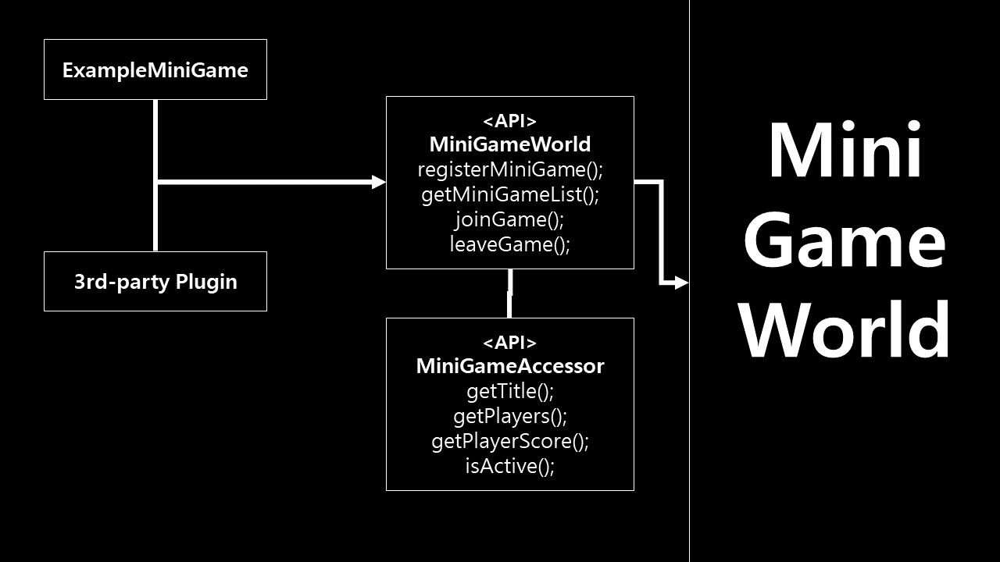

# Description
- This doucment describe how to make minigame with `MiniGameWorld`
- About MiniGameWorld plugin's structure: [Dev Wiki]

# API
<!-- </img> -->

- `Custom minigame` and `third-party` uses `MiniGameWorld` API
## API class
- `MiniGameWorld`: can access data of MiniGameWorld plugin, can register minigame to MiniGameWorld plugin
- `MiniGameAccessor`: can access data of registered minigame in MiniGameWorld plugin

# How to set Dev Environment
- [Paper]: Minecraft bukkit
- [MiniGameWorld]: MiniGame Framework
- [wbmMC]: Minecraft util library (not essential) 
- Add build path libs
- `plugin.yml`: add `[MiniGameWorld]` in `depend` section

# 제작
## 미니게임 제작
- [making-minigame-guide](making-minigame-guide.md)

## 3rd party 플러그인 제작
- [making-3rd-party-guide](making-3rd-party-guide.md)

# 유튜브 가이드
- [가이드]

# 연락
- [디스코드]

[Dev Wiki]: ../devWiki/home.md
[Paper]: https://papermc.io/
[MiniGameWorld]: https://github.com/worldbiomusic/MiniGameWorld/releases
[wbmMC]: https://github.com/worldbiomusic/wbmMC
[디스코드]: https://discord.com/invite/fJbxSy2EjA
[Paper API]: https://papermc.io/javadocs/paper/1.16/index.html?overview-summary.html
[BukkitRunnable 참고]: https://www.spigotmc.org/threads/prevent-already-scheduled-as-xxx-error.202486/#post-2103877
