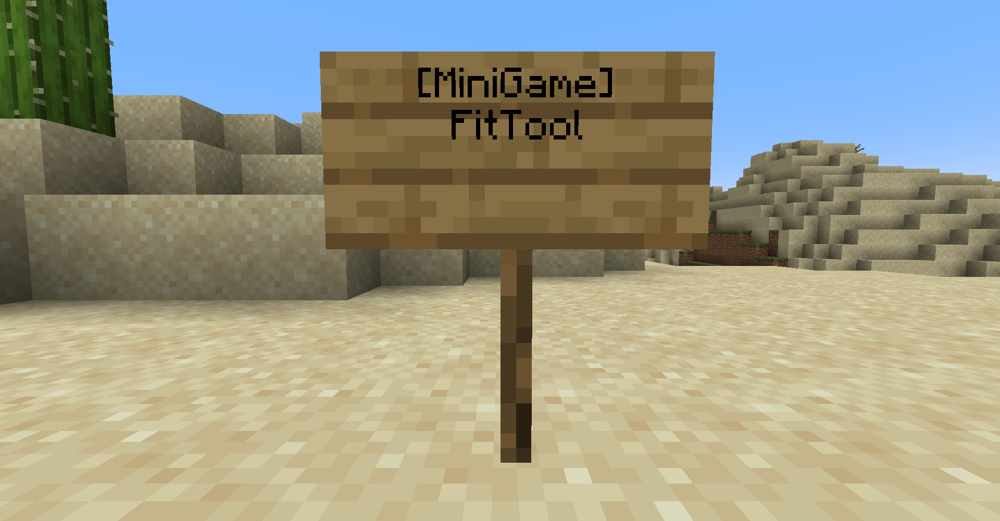

# Description
- This document describe how to use MiniGameWorld pluin in your server
- [Example MiniGames]()


# How to apply
1. Download [MiniGameWorld]
2. Download minigames that you want to add to your server
3. Locate MiniGameWorld and minigame plugin
4. Run the server and Enjoy


# Place
- You must make minigame place for playing
- You can set minigame location with `command` or `config(location)`


# Join / Leave
### 1. Sign
</img>
</img>
- Must set `minigame-sign` in `settings.yml` true

### 2. Command
- Join: `/minigame join <title>`
- Leave: `/minigame leave`
- Must set `minigame-command` in `settings.yml` true

### 3. GUI
- `/minigame gui`
- Join: click minigame
- Leave: click bed


# Types
- Solo
- SoloBattle
- Team
- Team Battle
- Custom


# Commands
- aliases: `mg`
## General
- `/minigame join <title>`: join `<title>` minigame
- `/minigame leave`: leave minigame that player is playing (when only waiting)
- `/minigame list`: print minigame list
- `/minigame gui`: open GUI
- `/minigame reload`: reload all configs
## Party
- `/minigame party invite <player>`: invite `<player>` to your party
- `/minigame party accept <player>`: accept `<player>`'s invitation
- `/minigame party ask <player>`: ask to `<player>` if you can join
- `/minigame party allow <player>`: allow `<player>`'s ask
- `/minigame party leave`: leave party
- `/minigame party kickvote <player>`: vote `<player>` that you want to kick
- `/minigame party msg <player>`: send message to player
- `/minigame party list`: show party member list
## Config
### settings
- `/minigame settings <key> <value>`: set server setting in `settings.yml` config file
### minigames
- `/minigame minigames <key> <value>`: set MiniGame setting in `minigames/<minigame>.yml` config file


# Tutorial
- [Tutorial]()


# Caution
- Not recommend to run `/reload` in the server console
- Player's `inventory`, `health`, `food level`, `exp`, `potion effects`, `glowing`, `hiding`, `game mode` will be stored at game starting and be restored at the game end


# Config
## `setting.yml`
- Plugin settings
```yml
settings:
  message-prefix: MiniGameWorld
  minigame-sign: true
  minigame-command: true
  lobby:
    ==: org.bukkit.Location
    world: world
    x: 0.0
    y: 4.0
    z: 0.0
    pitch: 0.0
    yaw: 90.0
```
- `lobby`: player will be teleport to location when game end
- `message-prefix`: system message of `MiniGameWorld` pluin
- `minigame-sign`: whether you can join or leave minigame with right-click sign (true / false)
- `minigame-command`: whether you can use plugin command (true / false)


## `minigames.yml`
- Minigame settings
```yml
PVP:
  title: PVP
  time-limit: 180
  min-player-count: 2
  custom-data:
    block-break: false
    health: 30
    score-notifying: true
    pvp: true
    inventory-save: true
    minigame-respawn: true
    items:
    - ==: org.bukkit.inventory.ItemStack
      v: 2730
      type: STONE_SWORD
    - ==: org.bukkit.inventory.ItemStack
      v: 2730
      type: BOW
    - ==: org.bukkit.inventory.ItemStack
      v: 2730
      type: ARROW
      amount: 32
    - ==: org.bukkit.inventory.ItemStack
      v: 2730
      type: COOKED_PORKCHOP
      amount: 10
    - ==: org.bukkit.inventory.ItemStack
      v: 2730
      type: GOLDEN_APPLE
    - ==: org.bukkit.inventory.ItemStack
      v: 2730
      type: WOODEN_AXE
    chatting: true
    block-place: false
  waiting-time: 10
  max-player-count: 5
  icon: STONE_SWORD
  active: true
  location:
    ==: org.bukkit.Location
    world: world
    x: 0.0
    y: 4.0
    z: 0.0
    pitch: 0.0
    yaw: 0.0
  tutorial:
  - 'kill: +1'
  
```
- `title`: 게임 제목
- `timeLimit`: 플레이 제한 시간 (초)
- `maxPlayerCount`: 최대 인원수 
- `icon`: GUI에 표시되는 아이템 아이콘
- `waitingTime`: 대기시간 (초)
- `active`: 게임 활성화 여부 (true/false)
- `scoreNotifying`: 스코어 변경 자동 알림 여부 (true/false) 
- `forceFullPlayer`: 게임 플레이어 수(`maxPlayerCount`) 강제 여부 (true/false)
- `location`: 입장 스폰 위치
- `customData`: 미니게임의 커스텀 설정 값
- `tutorial`: 튜토리얼 설명글
- 플러그인으로 넣은 미니게임이 자동으로 `minigames.yml`에 등록됨 
- 없는 미니게임은 서버가 종료된 후 `minigames.yml`에서 삭제됨
- 각 미니게임에 맞게 기본값이 설정되어 있음 (각 미니게임의 기본값 변경 원할 시: 해당 미니게임 개발자에게 질문)


# 연락
- [디스코드]

[미니게임 월드]: https://github.com/worldbiomusic/MiniGameWorld/releases
[wbmMC]: https://github.com/worldbiomusic/wbmMC
[디스코드]: https://discord.com/invite/fJbxSy2EjA
