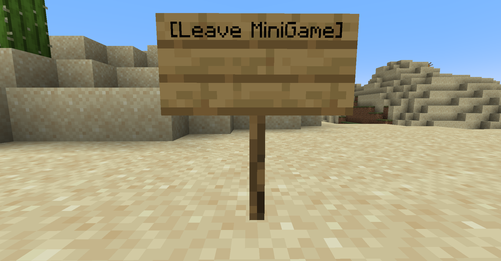

# 1. Sign
</img>
</img>
- Join
```yaml
[MiniGame]
 <title>
```
- Leave
```yaml
[Leave Minigame]
```
- Must set `minigame-sign` in `settings.yml` to true

# 2. Command
- Join: `/minigame join <title>`
- Leave: `/minigame leave`
- Must set `minigame-command` in `settings.yml` to true

# 3. MENU
- `/minigame menu`
- Join: click minigame
- Leave: click leave icon
- Must set `minigame-command` in `settings.yml` to true
