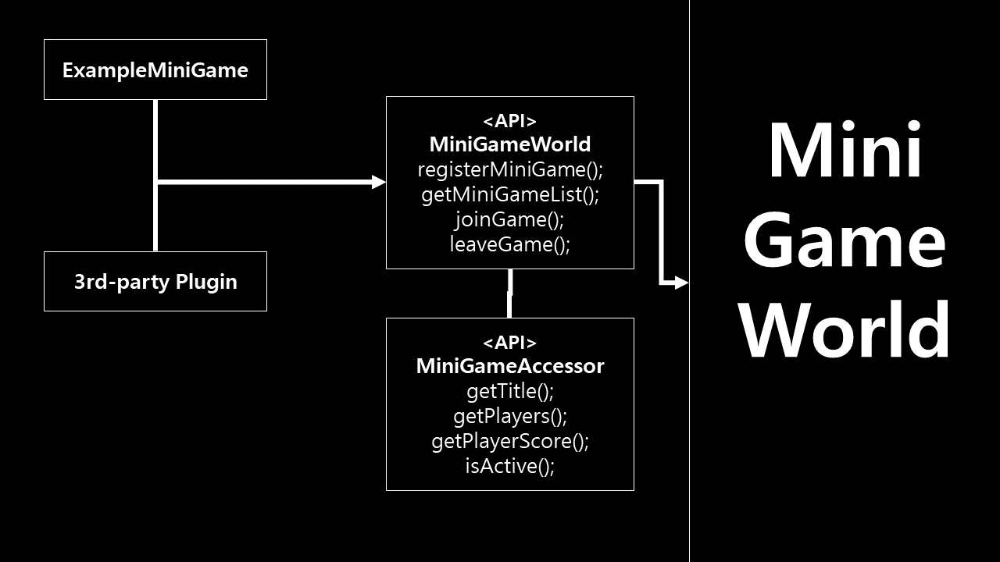

# 설명
- 미니게임 플러그인 제작에 관한 글
- 기본적인 사용법은 [사용 위키] 참고
- 내부 구조, 동작은 [개발 위키] 참고

# API 구조
<!-- </img> -->

- 미니게임월드 플러그인을 기반으로 만든 미니게임 플러그인들과 3rd party 플러그인은 API(MiniGameWorld)로 미니게임월드와 연결됨
## API class
- `MiniGameWorld`: `MiniGameWorld.create()`로 객체를 생성해서 미니게임을 등록, MiniGameWorld 플러그인에 대한 정보를 얻을 수 있음
- `MiniGameAccessor`: MiniGameWorld 등록된 미니게임에 대한 정보를 얻어 활용할 수 있음

# 환경 세팅 방법
- [Paper]: 마인크래프트 버킷
- [MiniGameWorld]: 미니게임 월드 플러그인
- [wbmMC]: 마인크래프트 플러그인 개발시 여러 기능을 작성해놓은 도와주는 라이브러리
- 다운로드 후 build path 추가
- `plugin.yml`: depend에 `[MiniGameWorld]` 추가

# 제작
## 미니게임 제작
- [making-minigame-guide](making-minigame-guide.md)

## 3rd party 플러그인 제작
- [making-3rd-party-guide](making-3rd-party-guide.md)

# 유튜브 가이드
- [가이드]

# 연락
- [디스코드]

[사용 위키]: playingMiniGameWiki.md
[개발 위키]: ../devWiki/home.md
[Paper]: https://papermc.io/
[MiniGameWorld]: https://github.com/worldbiomusic/MiniGameWorld/releases
[wbmMC]: https://github.com/worldbiomusic/wbmMC
[디스코드]: https://discord.com/invite/fJbxSy2EjA
[Paper API]: https://papermc.io/javadocs/paper/1.16/index.html?overview-summary.html
[BukkitRunnable 참고]: https://www.spigotmc.org/threads/prevent-already-scheduled-as-xxx-error.202486/#post-2103877
