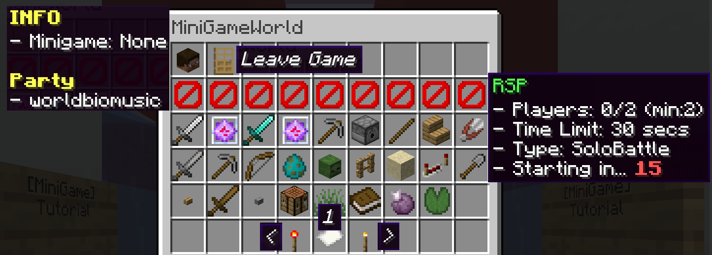

# Menu
- There are many things you can access like `control`, `minigames`, `party`(soon)
- Use `/mw menu` command to open gui menu
 
# Screenshot

-`INFO`: Show your current state (name, party members)
- `Leave game`: Leave game (also unview)
- `minigames`: Show minigame current state
> **join**(LEFT-CLICK), **view**(RIGHT_CLICK)
- `<`: Previous page
- `1`: Current page
- `>`: Next page