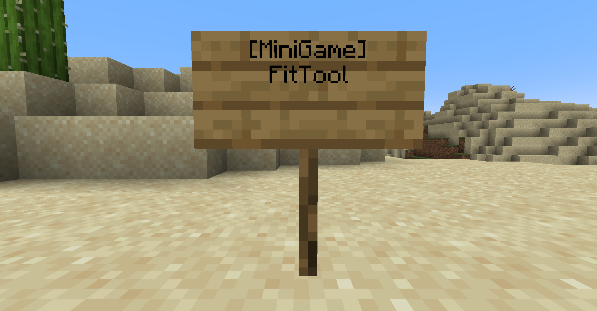

# Description
- This document describe how to use MiniGameWorld pluin in your server
- [Example MiniGames]()


# How to apply
1. Download [MiniGameWorld]
2. Download minigames that you want to add to your server
3. Locate MiniGameWorld and minigame plugin in your server `plugins` folder
4. Make minigame playground and set location
5. Run the server and Enjoy


# Join / Leave
### 1. Sign
</img>
</img>
- Join
```yaml
[MiniGame]
 <title>
```
- Leave
```yaml
[Leave Minigame]
```
- Must set `minigame-sign` in `settings.yml` to true

### 2. Command
- Join: `/minigame join <title>`
- Leave: `/minigame leave`
- Must set `minigame-command` in `settings.yml` to true

### 3. MENU
- `/minigame menu`
- Join: click minigame
- Leave: click leave icon
- Must set `minigame-command` in `settings.yml` to true


# Types
- Solo
- SoloBattle
- Team
- Team Battle
- Custom


# Commands
- aliases: `/mg`
## General
- `/minigame join <title>`: join `<title>` minigame
- `/minigame leave`: leave current playing minigame (when only waiting)
- `/minigame list`: print minigame list
- `/minigame menu`: open menu
- `/minigame reload`: reload all configs
## Party
- `/minigame party invite <player>`: invite `<player>` to your party
- `/minigame party accept <player>`: accept `<player>`'s invitation
- `/minigame party ask <player>`: ask to `<player>` if you can join
- `/minigame party allow <player>`: allow `<player>`'s ask
- `/minigame party leave`: leave party
- `/minigame party kickvote <player>`: vote `<player>` that you want to kick from your party
- `/minigame party msg <player>`: send message to player
- `/minigame party list`: show party member list
## Config
### settings
- `/minigame settings <key> <value>`: set plugin setting in `settings.yml` config file
### minigames
- `/minigame minigames <key> <value>`: set minigame setting in `minigames/<minigame>.yml` config file


# Party System
- Party **doesn't** have `leader`
- All members can `join` / `leave` minigames
- All members can `invite` / `allow` players
- All members can `kickvote` player 


# Third-Party plugin
- You can `give reward with rank `, `save rank data` and etc with third party plugins


# Tutorial
- [Tutorial]()


# Caution
- Not recommend to run `/reload` in the server console
- Player's `inventory`, `health`, `food level`, `exp`, `potion effects`, `glowing`, `hiding`, `game mode` will be stored at game starting and be restored at the game end


# Config
- Minigame has each files in `MiniGameWorld/minigames` folder
- Deleted minigame file will be removed automatically
- Minigame config created with default values by developer's settings
## `setting.yml`
- Plugin settings
```yml
settings:
  message-prefix: MiniGameWorld
  minigame-sign: true
  minigame-command: true
  lobby:
    ==: org.bukkit.Location
    world: world
    x: 0.0
    y: 4.0
    z: 0.0
    pitch: 0.0
    yaw: 90.0
```
- `lobby`: player will be teleport to location when game end
- `message-prefix`: system message of `MiniGameWorld` plugin
- `minigame-sign`: whether you can join or leave minigame with right-click sign (true / false)
- `minigame-command`: whether you can use plugin command (true / false)


## `minigames/<MiniGame>.yml`
- Minigame settings
```yml
PVP:
  title: PVP
  time-limit: 180
  min-player-count: 2
  max-player-count: 5
  waiting-time: 30
  active: true
  icon: STONE_SWORD
  location:
    ==: org.bukkit.Location
    world: world
    x: 100.0
    y: 70.0
    z: 100.0
    pitch: 0.0
    yaw: 0.0
  tutorial:
  - 'kill: +1'
  - 'give kit tools'
  custom-data:
    block-break: false
    block-place: false
    score-notifying: true
    pvp: true
    inventory-save: true
    minigame-respawn: true
    items:
    - ==: org.bukkit.inventory.ItemStack
      v: 2730
      type: STONE_SWORD
    - ==: org.bukkit.inventory.ItemStack
      v: 2730
      type: BOW
    - ==: org.bukkit.inventory.ItemStack
      v: 2730
      type: ARROW
      amount: 32
    - ==: org.bukkit.inventory.ItemStack
      v: 2730
      type: COOKED_PORKCHOP
      health: 30
    chatting: true
```
- `title`: minigame title (can be different with Class Name)
- `time-limit`: minigame playing time limit (sec)
- `min-player-count`: minimun player for playing game
- `max-player-count`: maximun player for playing game
- `waiting-time`: waiting time (sec)
- `active`: whether this minigame is active in the server(true/false)
- `icon`: Material which show in menu (Material)
- `location`: minigame join location
- `tutorial`: tutorials
- `custom-data`: custom data added by developer


[MiniGameWorld]: https://github.com/worldbiomusic/MiniGameWorld/releases
