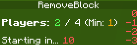
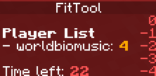
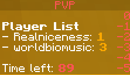
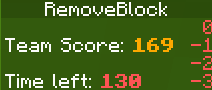
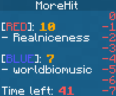

# Scoreboard
- There are 2 scoreboards: `waiting` and `play`
- There can be custom scoreboard created by other developers
- Minigame can remove scoreboard with `scoreboard` option

---

# Waiting Scoreboard

- Show minigame title
- Show current waiting player count
- Notify min player count for this game
- Show left time to start


# Play Scoreboard
## Solo

- Show solo player score

## Solo Battle

- Show all players score

## Team

- Show team score

## Team Battle

- Show team scores with players

---

# Scoreboard Conflict
- If more than 2 plugins update players' scoreboard, there may exist conflicts

## How to resolve
### - Off scoreboard system
- You can off scoreboard system by setting `scoreboard` to `false` in `plugins/MiniGameWorld/settings.yml`
### - Use API
- If you can edit a plugin which updates player scoreboard, do not update while a player is playing or viewing any minigames using `MiniGameWorld API`
- Example code
```java
class YourScoreboardUpdateManager {
	public void updateScoreboard() {
		MiniGameWorld mw = MiniGameWorld.create("x.x.x");

		// check MiniGameWorld scoreboard option is true
		if (!(boolean) mw.getSettings().get("scoreboard")) {
			Bukkit.getOnlinePlayers().forEach(p -> {
				// Update player scoreboard
				p.setScoreboard(original-scoreboard);
			});
			return;
		}

		// DO NOT update player scoreboard while playing
		for (Player p : Bukkit.getOnlinePlayers()) {
			// check player is playing minigame
			boolean isIn = MwUtil.checkPlayerIsInGame(p);
			if (isIn) {
				// check scoreboard option of minigame is true
				boolean useScoreboardOption = (boolean) MwUtil.getPlayingGame(p).getSettings().get("scoreboard");
				if (useScoreboardOption) {
					continue;
				}
			}

			// Update player scoreboard
			p.setScoreboard(original-scoreboard);
		}
	}
}
```